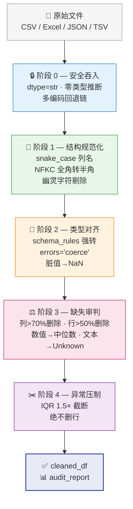

# Data Cleaning Skill — 工业级数据清洗管道

> 🏭 面向 AI 编程助手的生产级数据清洗工具。五阶段单向管道架构，四平台兼容。
>
> **数据清洗 · 数据预处理 · 缺失值处理 · 异常值检测 · ETL 管道 · pandas 工具**

[](https://www.codebuddy.cn)
[](https://claude.ai)
[](https://atomcode.atomgit.com)
[](https://mimo.xiaomi.com)
[](https://python.org)
[](LICENSE)

---

## 📋 目录

- [适合谁用](#适合谁用)
- [使用场景](#使用场景)
- [设计哲学](#设计哲学)
- [管道架构](#管道架构)
- [各平台安装与使用](#各平台安装与使用)
  - [WorkBuddy](#workbuddy)
  - [Claude Desktop](#claude-desktop)
  - [AtomCode](#atomcode)
  - [MiMo Code](#mimo-code)
  - [纯 Python API](#纯-python-api所有平台通用)
- [Schema Rules（类型映射）](#schema-rules类型映射)
- [审计报告](#审计报告)
- [关键行为保证](#关键行为保证)
- [运行测试](#运行测试)
- [依赖](#依赖)
- [文件结构](#文件结构)
- [常见问题](#常见问题)
- [贡献指南](#贡献指南)
- [License](#license)

---

## 适合谁用

| 角色 | 怎么用 | 收益 |
| ---- | ------ | ---- |
| **数据分析师** | CSV/Excel 拖进去，一句话说清要转什么类型 | 省去手写 `pd.to_numeric() + fillna() + clip()` 的重复劳动 |
| **数据工程师** | 集成到 ETL 管道，直接用 Python API | 有审计日志，出问题能回溯每一步 |
| **AI Coding 用户** | 对话中说"帮我把这个表洗一下" | 不用写代码，AI 自动加载 Skill 执行 |
| **团队管理者** | 把 Skill 装到团队 WorkBuddy/Claude 里 | 清洗标准统一，不再每人一套脚本 |
| **Python 初学者** | 直接 `import`，一行调用 | 不需要懂 pandas 细节就能做专业数据清洗 |

## 使用场景

### 场景一：用户调研数据清洗

从问卷平台导出 2 万行 CSV，列名是中文、有全角空格、年龄填了"二十岁"、"35+"、"中年"……

**用本工具：** `schema_rules={"年龄": "int", "收入": "float"}`，一行代码拿到干净数据 + 审计报告。

### 场景二：多源数据合并前的标准化

三个部门交上来的 Excel 格式各不相同：有的用 `User Name`，有的用 `user_name`，有的用 `用户名`……

**用本工具：** 列名自动统一为 snake_case，NFKC 全角转半角，幽灵字符剔除。

### 场景三：生产 ETL 管道中的质量守门员

每天凌晨自动入库的 CSV 数据，上游可能丢字段、可能混入脏值……

**用本工具：** `execute()` 返回的 `audit` dict 直接 JSON 序列化送到监控系统。留存率低于阈值自动告警。

### 场景四：AI 辅助数据分析

跟 WorkBuddy 对话："帮我把本周的销售数据洗一下，金额转 float，日期转 datetime"

**用本工具：** AI 自动加载此 Skill，识别文件类型、执行五阶段管道、输出干净数据。

---

## 设计哲学

**永不静默丢弃数据。永不信任自动类型推断。永不删除异常行。全程可审计。**

❌ 这不是一个 `df.dropna()` 脚本。  
✅ 每一步操作都有记录，每一次删除都有日志，每一个异常值都被截断到边界值——而不是被删除。

区别对比：

| 做法 | 普通脚本（什么不该做） | 本 Skill（怎么做） |
| ---- | :--------------------: | :----------------: |
| 读取 CSV | `pd.read_csv()` 自动推断 | `dtype=str` 全文本，零推断 |
| 工号 "001" | 变成 1，前导零丢失 | 保持 "001" |
| 年龄 "二十岁" | 直接报错崩溃 | 转 NaN，中位数填充 |
| 长数字 ID | 变科学计数法 | 字符串不变 |
| 某列 90% 空 | 留着污染分析 | 整列砍掉 + 审计记录 |
| 异常值 200000 | 静默删行 | 截断到 IQR 上界 |

---

## 管道架构



**五阶段详解：**

| 阶段 | 方法 | 核心行为 | 安全保证 |
|:----:| ---- | -------- | -------- |
| 0 | `_safe_ingest()` | 全字符串读入，零类型推断 | 工号"001"不变1，长数字不变科学计数法 |
| 1 | `_standardize()` | 列名→snake_case，NFKC半角化，`​‌‍`剔除 | 全角空格、零宽字符自动清理 |
| 2 | `_type_alignment()` | `errors='coerce'`强转 | "二十岁"转NaN，不报错，由阶段3填充 |
| 3 | `_missing_trial()` | 列>70%删，行>50%删；数值中位数，文本Unknown | 整行删除有日志，填充策略可审计 |
| 4 | `_outlier_suppression()` | IQR 1.5× Winsorizing | 异常值截断到边界，数据量一条不少 |

---

## 各平台安装与使用

### WorkBuddy

```bash
workbuddy skill install https://github.com/lytssaa/data-cleaning-skill
```

或在对话中：
```
帮我安装 data-cleaning skill，仓库地址 https://github.com/lytssaa/data-cleaning-skill
```

**使用：**
```
帮我把 sales_2024.csv 洗一下，age 转 int，salary 转 float
```

---

### Claude Desktop

```bash
# 1. 安装依赖
pip install mcp pandas pyarrow openpyxl

# 2. 克隆仓库
git clone https://github.com/lytssaa/data-cleaning-skill.git ~/data-cleaning-skill
```

**3. 配置 Claude Desktop：**

编辑 `claude_desktop_config.json`：

```json
{
  "mcpServers": {
    "data-cleaning": {
      "command": "python",
      "args": ["adapters/claude/server.py"],
      "cwd": "/Users/你的用户名/data-cleaning-skill"
    }
  }
}
```

**4. 重启 Claude Desktop**

**使用：**
```
用 data-cleaning 工具清洗 sales.csv，age 转 int，amount 转 float
```

---

### AtomCode

```bash
git clone https://github.com/lytssaa/data-cleaning-skill.git ~/.atomcode/skills/data-cleaning
```

**使用：**
```
/data-cleaning
# 或
清洗 dirty_data.csv，把 age 转 int，price 转 float
```

---

### MiMo Code

```bash
git clone https://github.com/lytssaa/data-cleaning-skill.git ~/.config/mimocode/skills/data-cleaning
```

或在 `mimocode.json` 中：
```json
{ "skills": { "urls": ["https://github.com/lytssaa/data-cleaning-skill/releases/latest/download/bundle.json"] } }
```

**使用：**
```
清洗 survey_results.xlsx，respondent_age 转 int，income 转 float
```

---

### 纯 Python API（通用）

```python
from scripts.clean import DataPipelineCleaner

cleaner = DataPipelineCleaner()
cleaned_df, audit = cleaner.execute(
    file_path="dirty_survey.csv",
    schema_rules={"age": "int", "income": "float", "signup_date": "datetime"},
)

print(f"留存率: {audit['retention_rate_pct']}%")
print(f"修复缺失值: {audit['missing_values_fixed']} 处")
print(f"压制异常值: {audit['outliers_suppressed']} 处")
```

---

## Schema Rules（类型映射）

```python
schema_rules = {
    "age":         "int",       # → Int64 (nullable)
    "salary":      "float",     # → float64
    "name":        "str",       # → string
    "join_date":   "datetime",  # → datetime64[ns]
}
```

未列出的列保持字符串，安全第一。

---

## 审计报告

```json
{
  "original_rows": 10000,
  "cleaned_rows": 9850,
  "retention_rate_pct": 98.5,
  "dropped_columns": ["useless_survey_field"],
  "dropped_rows_count": 150,
  "missing_values_fixed": 423,
  "outliers_suppressed": 37,
  "per_column": {
    "coercion": { "age": { "target_type": "int", "invalid_values_coerced_to_null": 12 } },
    "imputation": { "city": { "strategy": "constant", "fill_value": "Unknown", "count": 35 } },
    "outlier_winsorizing": { "income": { "method": "IQR", "lower_fence": 1500, "upper_fence": 85000 } }
  },
  "warnings": []
}
```

---

## 关键行为保证

| 场景 | 普通 pandas 脚本 | 本 Skill |
| ---- | :--------------: | :------: |
| 工号 "001" | ❌ 变 1 | ✅ 保持 "001" |
| 年龄填 "二十岁" | ❌ 报错 | ✅ 转 NaN → 中位数填充 |
| 薪资 200000（异常） | ❌ 静默删行 | ✅ 截断到 IQR 上界 |
| 长数字身份证 | ❌ 变科学计数法 | ✅ 字符串保留 |
| 某列 90% 空 | ❌ 污染分析 | ✅ 整列砍掉 + 审计 |
| 全角空格列名 | ❌ 程序出错 | ✅ 自动 snake_case |
| 零宽字符混入 | ❌ 肉眼不见 | ✅ 正则剔除 |

---

## 运行测试

```bash
python scripts/clean.py
```

内置脏数据测试：全角空格、零宽字符、中文数字、极端异常值、90% 缺失列。

---

## 依赖

```bash
pip install pandas pyarrow openpyxl

# Claude Desktop 额外需要:
pip install mcp
```

---

## 文件结构

```
data-cleaning-skill/
├── README.md              ← 你正在看的文件
├── SKILL.md               ← Skill 入口定义
├── scripts/
│   ├── clean.py           ← ★ 核心管道类（686 行）
│   ├── profile.py         ← 数据画像工具
│   └── quality_report.py  ← 审计报告渲染
├── adapters/claude/       ← Claude Desktop MCP
├── references/            ← 中文清洗、策略详解
└── assets/                ← 配置示例
```

---

## 常见问题

**Q：为什么不用 pandas 默认类型推断？**  
A：默认推断会把 "001" 变 1，长数字变科学计数法。本 Skill 一律 `dtype=str` 读入，只有明确指定的列才转换。

**Q：异常值为什么不删除？**  
A：删除会丢信息。Winsorizing 只截断极端值，数据量一条不少。

**Q：能处理多大体积？**  
A：PyArrow 后端节省 30-50% 内存。10 万行轻松，百万行可跑。

---

## License

MIT © 2026 lytssaa
